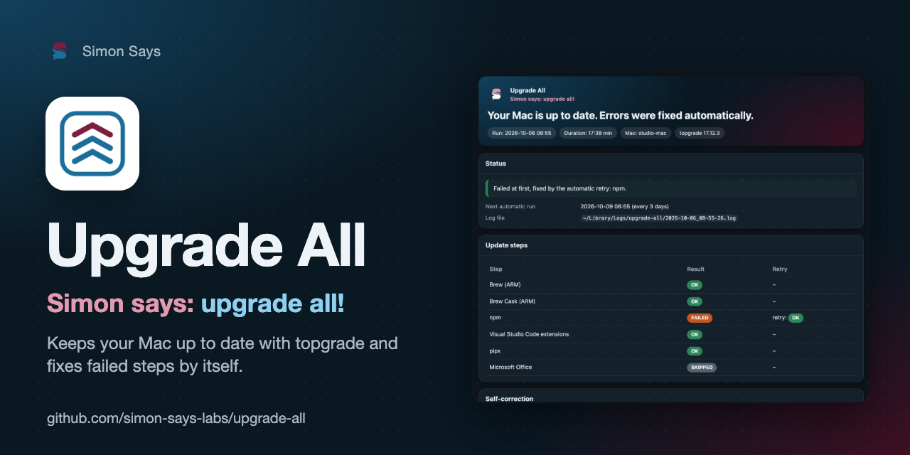
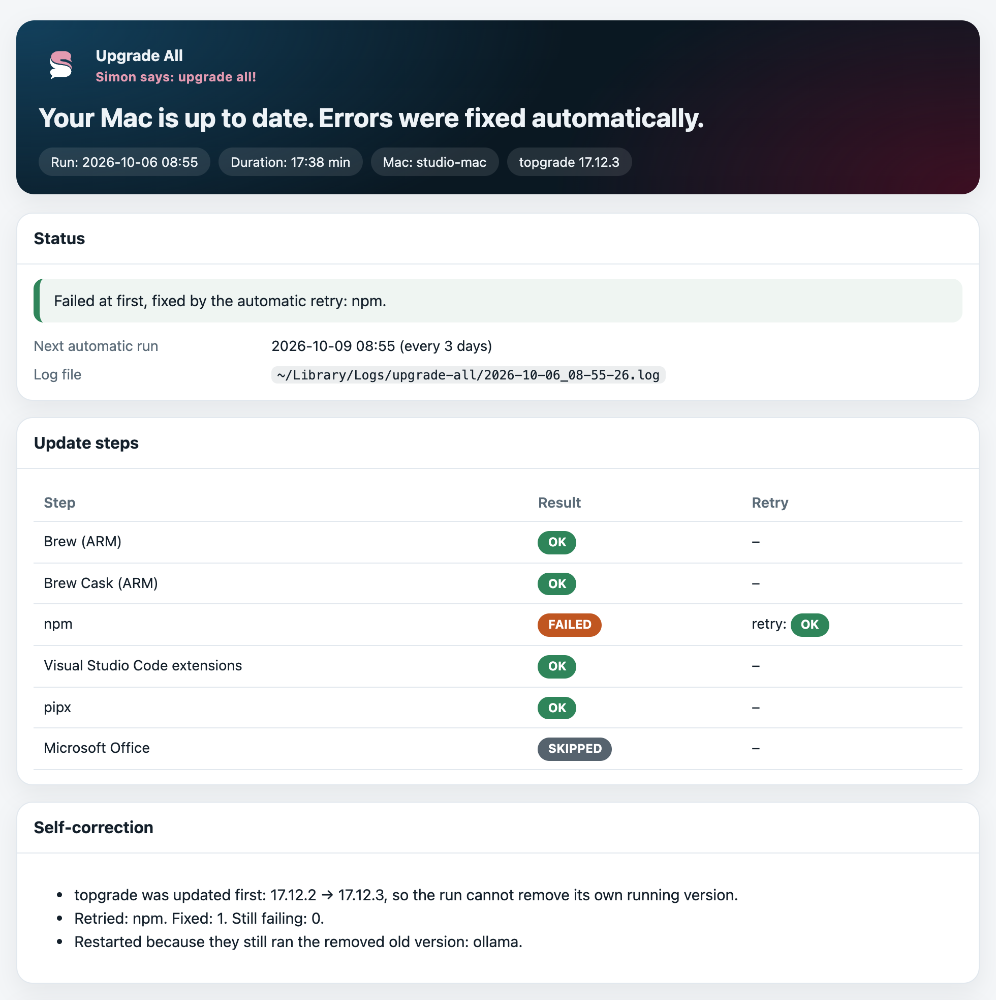

<p align="center"></p>

# Upgrade All

<p align="center"><b><a href="#deutsch">🇩🇪 Deutsch</a> · <a href="#english">🇬🇧 English</a> · <a href="docs/README.fr.md">🇫🇷 Français</a> · <a href="docs/README.it.md">🇮🇹 Italiano</a> · <a href="docs/README.es.md">🇪🇸 Español</a></b></p>

> 🇩🇪 **Simon says: upgrade all!** Hält deinen Mac mit [topgrade](https://github.com/topgrade-rs/topgrade) alle paar
> Tage im Hintergrund aktuell, behebt typische Fehler selbst und zeigt danach einen verständlichen Bericht.
> Entstanden aus der Suche nach einem Gegenstück zu `winget upgrade --all` für den Mac.
>
> 🇬🇧 **Simon says: upgrade all!** Keeps your Mac up to date with [topgrade](https://github.com/topgrade-rs/topgrade),
> unattended, every few days, fixes the typical hiccups by itself and tells you in a clear report what happened.
> Born from looking for a Mac equivalent of `winget upgrade --all`.

<p align="center"></p>

## Deutsch

### Warum alles aktuell halten, gerade für KI und Vibe Coding

Wer mit einem KI-Assistenten programmiert, lässt ihn mit den Werkzeugen auf **dem eigenen** Rechner arbeiten: git,
Node, Python, uv, GitHub CLI, Compiler, MCP-Server, die Kommandozeile des Assistenten und seine Editor-Erweiterung.
Dass eines davon veraltet ist, sieht der Assistent nicht. Er liest Dokumentation und Beispiele für aktuelle
Versionen, ruft Optionen auf, die die alte Version nicht kennt, und sucht dann Fehler, die ein einziges Update
beseitigt hätte. Am schnellsten ändern sich die KI-Werkzeuge selbst: neue Modelle, neue Befehle und Korrekturen
kommen als Update.

Updates bringen außerdem die Sicherheitskorrekturen für alles, was ein Agent in deinem Namen ausführt.

Wie viel das in der Praxis ist, gemessen auf dem Mac, von dem dieses Projekt stammt: Zwischen dem 17. Juli und dem
6. Oktober 2026 haben 24 Läufe **356 Homebrew-Pakete** aktualisiert (Formeln und Apps), dazu npm, pipx,
VS-Code-Erweiterungen, Container und KI-Modelle. Von Hand hält das niemand durch.

### Woher es kommt

Unter Windows aktualisiert `winget upgrade --all` alle installierten Programme auf einmal. Genau das suchte ich für
den Mac und fand [topgrade](https://github.com/topgrade-rs/topgrade), ein hervorragendes Werkzeug, das Homebrew,
Apps, Paketmanager, Editor-Erweiterungen und vieles mehr mit einem Befehl aktualisiert. Es fehlte nur, dass es
zuverlässig ohne mich läuft: nach Plan, ohne Rückfragen, mit Selbstkorrektur bei den typischen Stolpersteinen und
einem Bericht danach. Das ist Upgrade All. Seit es alle paar Tage im Hintergrund läuft, muss ich mir um Updates
keine Gedanken mehr machen.

### Was ein Lauf tut

1. **Erneuert zuerst topgrade.** Sonst aktualisiert der Homebrew-Schritt topgrade während des Laufs, und `--cleanup`
   entfernt den Ordner der Version, die gerade läuft. Spätere Schritte, die geschützte Orte berühren (zum Beispiel
   eine externe Festplatte), verweigert macOS dann, mit irreführenden Meldungen.
2. **Startet topgrade ohne Rückfragen** (`--yes --no-ask-retry --no-self-update --cleanup`). macOS-Systemupdates
   bleiben außen vor, weil sie ein Passwort verlangen.
3. **Startet Homebrew-Dienste neu**, die noch eine Version ausführen, deren Ordner gerade entfernt wurde.
4. **Wiederholt jeden fehlgeschlagenen Schritt einmal** nach einer kurzen Pause, genau diesen Schritt
   (`topgrade --only <schritt>`). Die Schrittnamen stammen aus topgrades eigenem Quellcode; die Zusammenfassung wird
   deshalb in jeder Sprache verstanden, die topgrade spricht.
5. **Führt deine Zusatzschritte aus** dem Hook-Ordner aus.
6. **Schreibt einen Bericht** und öffnet ihn im Browser (immer, nur bei Problemen oder nie). Alte Läufe wandern nach
   einer Weile in den Papierkorb; gelöscht wird nichts.

### Installieren

Braucht macOS, [Homebrew](https://brew.sh) und topgrade (`brew install topgrade`). Upgrade All selbst hat keine
Abhängigkeiten: Es läuft mit `/usr/bin/python3`, das mit Apples Command Line Tools kommt. Der Homebrew-Installer
richtet sie ein, sonst `xcode-select --install`.

```bash
git clone https://github.com/simon-says-labs/upgrade-all
cd upgrade-all
/usr/bin/python3 -m upgrade_all install
```

Das kopiert das Programm nach `~/Library/Application Support/upgrade-all/` und richtet den Hintergrundauftrag
`labs.simon-says.upgrade-all` ein (alle 3 Tage). Gleich ausprobieren:

```bash
~/Library/Application\ Support/upgrade-all/upgrade-all run
```

### Befehle

| Befehl | Tut |
|---|---|
| `upgrade-all run` | Jetzt aktualisieren (das führt auch der Hintergrundauftrag aus). |
| `upgrade-all status` | Hintergrundauftrag, letzter Lauf, nächster Lauf, letzter Bericht. |
| `upgrade-all grant-access [schritt]` | Lässt macOS erneut nach dem Zugriff für das aktuelle topgrade fragen (siehe unten). |
| `upgrade-all install` | Installieren oder aktualisieren; deine Einstellungen bleiben. `--no-agent` ohne Hintergrundauftrag. |
| `upgrade-all uninstall` | Meldet den Hintergrundauftrag ab und verschiebt das Programm in den Papierkorb. `--logs` auch die Logs. |

### Einstellungen

`~/Library/Application Support/upgrade-all/config.json`:

| Einstellung | Vorgabe | Bedeutung |
|---|---|---|
| `interval_days` | `3` | Tage zwischen zwei Läufen. Nach einer Änderung `install` erneut ausführen. |
| `language` | `auto` | Sprache des Berichts: `auto` (macOS-Sprache), `en`, `de`, `fr`, `it`, `es`. |
| `disable_steps` | `["system"]` | Ausgelassene topgrade-Schritte, z. B. `["system", "uv"]`. |
| `cleanup` | `true` | Alte Versionen nach dem Aktualisieren entfernen (`--cleanup`). |
| `pre_upgrade_topgrade` | `true` | topgrade vor dem Lauf mit Homebrew erneuern. |
| `restart_outdated_services` | `true` | Homebrew-Dienste neu starten, die noch eine entfernte Version ausführen. |
| `retry_failed` | `true` | Fehlgeschlagene Schritte einmal wiederholen. |
| `retry_delay_seconds` | `30` | Pause vor der Wiederholung. |
| `timeout_minutes` | `180` | topgrade beenden, wenn es länger dauert. |
| `open_report` | `always` | `always` (immer), `problems` (nur bei Problemen) oder `never` (nie). |
| `keep_runs` | `60` | Aufbewahrte Läufe; ältere Logs und Berichte gehen in den Papierkorb. |
| `access_probe_step` | `skills` | Schritt für `grant-access`, wenn der letzte Lauf keinen genannt hat. |
| `extra_topgrade_args` | `[]` | Weitere Argumente für topgrade, z. B. `["--disable", "containers"]`. |

### Zusatzschritte (Hooks)

Ausführbare Dateien in `~/Library/Application Support/upgrade-all/hooks/` legen. Sie laufen nach topgrade, in der
Reihenfolge ihrer Namen. Exitcode `0` heißt OK, `3` übersprungen, alles andere fehlgeschlagen. Eine Zeile, die mit
`Summary:` beginnt, erscheint im Bericht. Gesetzt sind `UPGRADE_ALL_LANGUAGE` und `UPGRADE_ALL_LOGS`. Ein
Zusatzschritt ändert nie topgrades Ergebnis. Ein Beispiel, das ein Brewfile aller installierten Pakete pflegt,
liegt in [examples/hooks](examples/hooks).

Ein Hook auf einer externen Festplatte kann im Hintergrund mit `Operation not permitted` scheitern (Exit 126):
macOS prüft den Zugriff je Programm, und `/bin/sh` hat dort meist keine Erlaubnis. Solche Hooks auf die interne
Platte legen oder von einem Interpreter starten lassen, der den Zugriff schon hat (zum Beispiel
`#!/opt/homebrew/bin/python3`).

### Wenn macOS den Zugriff verweigert

macOS merkt sich manche Erlaubnisse, etwa den Zugriff auf Dateien einer externen Festplatte, **je Programmdatei**.
Der Pfad von topgrade enthält die Version; jedes topgrade-Update beginnt deshalb ohne diese Erlaubnis, und im
Terminal fragt macOS nie danach, weil dort die Terminal-App verantwortlich ist, nicht topgrade. Wird ein Schritt
auch nach der Wiederholung verweigert, sagt der Bericht das und nennt den Befehl:

```bash
upgrade-all grant-access skills
```

Er startet genau diesen Schritt als Hintergrundauftrag, so wie der geplante Lauf, damit macOS fragt; dann auf
**Erlauben** klicken.

### Entwicklung

```bash
/usr/bin/python3 -m unittest discover -s tests       # Stand-ins für topgrade und brew, nichts wird aktualisiert
/usr/bin/python3 -m upgrade_all sample-report /tmp/report.html --language de
/usr/bin/python3 tools/update_steps.py v17.12.3       # Schritt-Tabelle aus topgrades Quellcode erneuern
```

Siehe [CONTRIBUTING.md](CONTRIBUTING.md). Änderungen: [CHANGELOG.md](CHANGELOG.md).

### Lizenz

[MIT](LICENSE) © 2026 Simon Eckmiller · veröffentlicht von [Simon Says](https://github.com/simon-says-labs).
Fremdbestandteile: [THIRD_PARTY_NOTICES.md](THIRD_PARTY_NOTICES.md). Upgrade All ist ein unabhängiges Projekt und
kein Teil von topgrade.

<p align="right"><a href="#upgrade-all">↑ Zur Sprachauswahl</a></p>

## English

### Why keep everything up to date, especially for AI and vibe coding

When you code with an AI assistant, the assistant works with the tools on **your** machine: git, Node, Python,
uv, the GitHub CLI, compilers, MCP servers, the assistant's own command line tool and its editor extension. It
cannot see that one of them is outdated. It reads documentation and examples written for current versions,
calls flags your old version does not know, and spends your time chasing errors that a single update would have
removed. The AI tools themselves move fastest of all: new models, new commands and fixes arrive as updates.

Updates also carry the security fixes for everything a coding agent runs on your behalf.

How much that is in practice, measured on the Mac this project comes from: between 17 July and 6 October 2026,
24 runs updated **356 Homebrew packages** (formulae and apps), plus npm, pipx, VS Code extensions, containers and
AI models. Nobody keeps that up by hand.

### Where it came from

On Windows, `winget upgrade --all` updates every installed application in one go. I was looking for the same on
the Mac and found [topgrade](https://github.com/topgrade-rs/topgrade), an excellent tool that updates Homebrew,
apps, language package managers, editor extensions and much more in a single command. What was missing was
running it reliably without me: on a schedule, without questions, fixing the typical hiccups by itself and
telling me afterwards what happened. That is Upgrade All. Since it runs every few days in the background, I no
longer have to think about updates at all.

### What a run does

1. **Updates topgrade first.** Otherwise the run's Homebrew step updates topgrade itself and `--cleanup` removes
   the folder of the version that is still running. Later steps that touch protected places (for example an
   external disk) are then denied by macOS, with misleading messages.
2. **Runs topgrade without questions** (`--yes --no-ask-retry --no-self-update --cleanup`, macOS system updates
   left out because they ask for a password).
3. **Restarts Homebrew services** that still run a version whose folder was just removed.
4. **Retries every failed step once**, after a short pause, with exactly that step (`topgrade --only <step>`).
   The step names come from topgrade's own source, so the summary is understood in every language topgrade
   speaks.
5. **Runs your extra steps** from the hooks folder.
6. **Writes a report** and opens it in your browser (always, only on problems, or never). Old runs go to the
   Trash after a while; nothing is deleted.

### Install

Needs macOS, [Homebrew](https://brew.sh) and topgrade (`brew install topgrade`). Upgrade All itself has no
dependencies: it runs on `/usr/bin/python3`, which comes with Apple's Command Line Tools. The Homebrew installer
sets them up; otherwise `xcode-select --install`.

```bash
git clone https://github.com/simon-says-labs/upgrade-all
cd upgrade-all
/usr/bin/python3 -m upgrade_all install
```

This copies the program to `~/Library/Application Support/upgrade-all/` and sets up the background job
`labs.simon-says.upgrade-all` (every 3 days). Try it right away:

```bash
~/Library/Application\ Support/upgrade-all/upgrade-all run
```

### Commands

| Command | Does |
|---|---|
| `upgrade-all run` | Update now (this is what the background job runs). |
| `upgrade-all status` | Background job, last run, next run, last report. |
| `upgrade-all grant-access [step]` | Lets macOS ask again for access for the current topgrade (see below). |
| `upgrade-all install` | Install or update; keeps your settings. `--no-agent` skips the background job. |
| `upgrade-all uninstall` | Unloads the background job and moves the program to the Trash. `--logs` moves the logs too. |

### Settings

`~/Library/Application Support/upgrade-all/config.json`:

| Setting | Default | Meaning |
|---|---|---|
| `interval_days` | `3` | Days between runs. Run `install` again after changing it. |
| `language` | `auto` | Report language: `auto` (macOS language), `en`, `de`, `fr`, `it`, `es`. |
| `disable_steps` | `["system"]` | topgrade steps to leave out, e.g. `["system", "uv"]`. |
| `cleanup` | `true` | Remove old versions after updating (`--cleanup`). |
| `pre_upgrade_topgrade` | `true` | Update topgrade with Homebrew before the run. |
| `restart_outdated_services` | `true` | Restart Homebrew services that still run a removed version. |
| `retry_failed` | `true` | Retry failed steps once. |
| `retry_delay_seconds` | `30` | Pause before the retry. |
| `timeout_minutes` | `180` | Stop topgrade if it takes longer. |
| `open_report` | `always` | `always`, `problems` or `never`. |
| `keep_runs` | `60` | Runs to keep; older logs and reports go to the Trash. |
| `access_probe_step` | `skills` | Step `grant-access` uses when the last run named none. |
| `extra_topgrade_args` | `[]` | More arguments for topgrade, e.g. `["--disable", "containers"]`. |

### Extra steps (hooks)

Put executable files into `~/Library/Application Support/upgrade-all/hooks/`. They run after topgrade, in name
order. Exit code `0` means OK, `3` skipped, anything else failed. A line starting with `Summary:` appears in the
report. `UPGRADE_ALL_LANGUAGE` and `UPGRADE_ALL_LOGS` are set. An extra step never changes topgrade's result.
See [examples/hooks](examples/hooks) for one that keeps a Brewfile of everything installed.

A hook that lives on an external disk may fail in the background with `Operation not permitted` (exit 126):
macOS checks access per program, and `/bin/sh` usually has no permission there. Keep such hooks on the internal
disk, or let an interpreter that already has access run them (for example `#!/opt/homebrew/bin/python3`).

### When macOS denies access

macOS remembers some permissions, such as access to files on an external disk, **per program file**. topgrade's
file path contains its version, so every topgrade update starts without that permission, and from a terminal
macOS never asks for it: there the terminal app is responsible, not topgrade. If a step is still denied after
the retry, the report says so and names the command:

```bash
upgrade-all grant-access skills
```

It runs that one step as a background job, the way the scheduled run does, so macOS asks; click **Allow**.

### Development

```bash
/usr/bin/python3 -m unittest discover -s tests       # stand-ins for topgrade and brew, nothing is updated
/usr/bin/python3 -m upgrade_all sample-report /tmp/report.html --language de
/usr/bin/python3 tools/update_steps.py v17.12.3       # refresh the step table from topgrade's source
```

See [CONTRIBUTING.md](CONTRIBUTING.md). Changes: [CHANGELOG.md](CHANGELOG.md).

### License

[MIT](LICENSE) © 2026 Simon Eckmiller · published by [Simon Says](https://github.com/simon-says-labs).
Third-party parts: [THIRD_PARTY_NOTICES.md](THIRD_PARTY_NOTICES.md). Upgrade All is an independent project and not
part of topgrade.

<p align="right"><a href="#upgrade-all">↑ Back to language choice</a></p>
